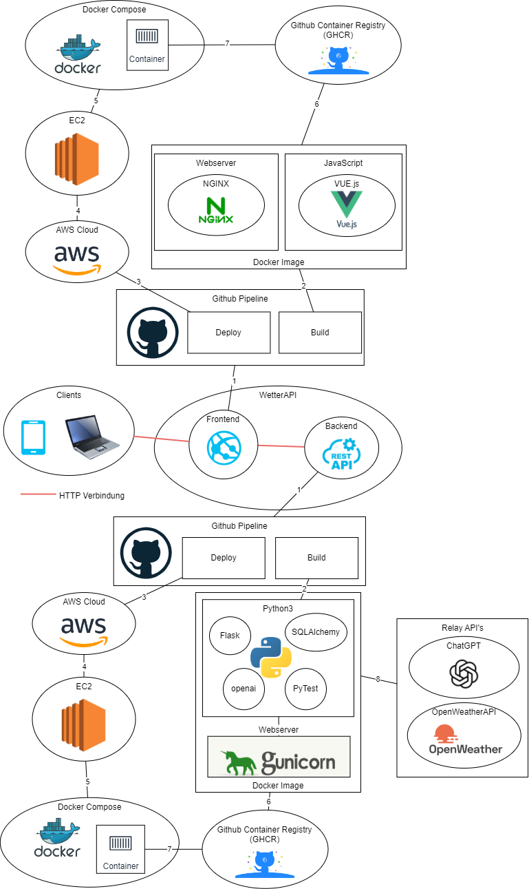

# 2.6 Seusag

[Quelle Bild - Selbsterstellt](../anhang/600-quellen.html#61-bilder)

1. Wird aus Github Pipeline erstellt / deployt.
2. Die Pipeline buildet ein Docker Image, die Inhalte des Images sind als Bilder eingefügt.
3. Nach dem Builden wird die deploy Stage ausgeführt. Wir deployen auf eine AWS Academy Instanz.
4. Wir verwenden normale EC2 Server, mit einem AWS Linux.
5. Auf diesen diesen Maschinen ist Docker und Docker Compose installiert.
6. Das gebuildete Docker Image wird auf die Github Container Registry (GHCR) gepusht.
7. Im Docker Compose des Servers wird auf das Docker Image in der GHCR verwiesen. Dieses wird gepullt und gestartet.
8. Anbindungen an externe APIs
