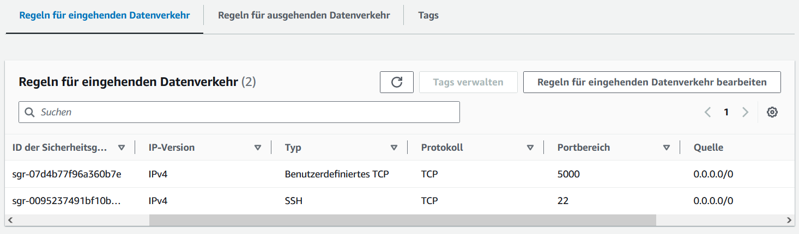
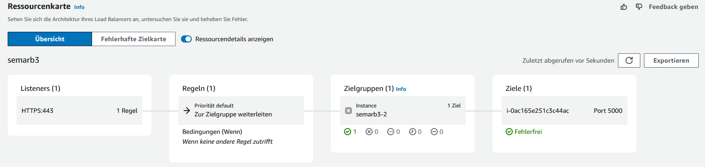
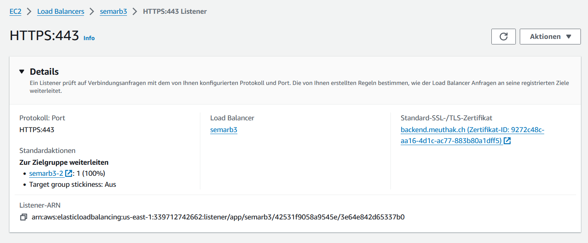

# 3.1.2 Infrastruktur

Das Backend wir mittels einer Github Pipeline auf unsere Production Umgebung gepusht.

Um Kosten zu sparen, haben wir dies mittels AWS Academy erledigt. Wir starten innerhalb der AWS Academy einen EC2 Server, welcher als Deployment Ziel fungiert. Für die Zertifikate der Applikation nutzen wir den AWS Load Balancer. Ich werde diese Punkte hier genauer erklären.

## Ressourcen und IP Adresse

Für die EC2 Instanz haben wir einen ganz einfachen t2.micro Server mit einem 2023 Amazon Linux AMI. Wir haben keine Cloud-Init Config genutzt oder sonstige Spezialconfig verwendet. Auf dem leeren Image mussten wir lediglich Docker und Docker Compose nachinstallieren.

Für die öffentliche IP Adresse der EC2 Instanz wollten wir eine statische IP und haben daher eine Elastic-IP-Adresse genutzt.

Die zugewiesene Elastic IP ist:

44.194.144.99

Für die Sicherheitsgruppe der Instanz erlauben wir lediglich SSH für das Management und den Port 5000 für die HTTP Anbindung des Backends.

{: width="1000px" }

## Load Balancer

Da uns die EC2 Instanz eine Öffentliche IP bereitstellt, nutzen wir die Chance des AWS Load Balancers um ein Zertifikat für unseren Service zu erhalten. Der Load Balancer beinhaltet folgende Teile. Jede Abfrage auf den Load Balancer muss durch jedes Teilstück durchgehen.

{: width="1000px" }

Zusätzlich ist auf dem Listener ein Zertifikat bereitgestellt, für die Domain:

<https://backend.meuthak.ch>

{: width="1000px" }

Dazu musste ich au meiner Domain folgende Einträge hinzufügen:

``` bash
...
backend                                      3600 IN CNAME semarb3-1577038455.us-east-1.elb.amazonaws.com.
_dasisteintest123456789e3260f8f90.backend    3600 IN CNAME _dasisteintest3c1821234567897bee9.sdgjtdhdhz.acm-validations.aws..
...
```
