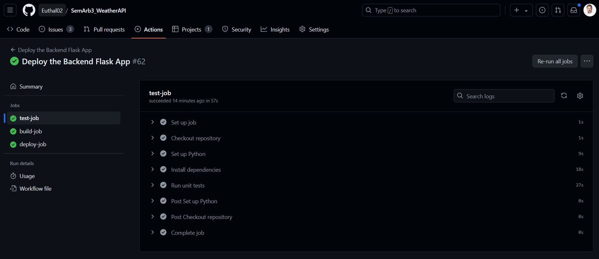

# 3.1.5 Testing

## Manuelle Tests

Im Rahmen der Frontend Entwicklung wurde das Backend ausgiebig getestet. Da dem Frontend jedoch nur eine einzelne Route verfügbar ist, haben wir darauf verzichtet ein Test Protokoll zu führen.

## Automatisierte Tests

Wir nutzen automatisierte Tests um bei jedem Commit erneut zu testen ob die App noch so funktioniert wie wir dies brauchen.

Falls diese Tests failen, kann das deployment nicht durchgeführt werden.

Es gibt zwei Möglichkeiten diese Tests auszuführen. Zum einen auf dem lokalen Development Gerät.
Dazu muss man einfach mittels Docker Compose einen neuen "Test Container" erstellen.

Dieser Test Container beeinflusst das Betriebssystem des Geräts nicht, jegliche Abhängigkeiten welche installiert werden, werden nach der Ausführung wieder gelöscht.

``` bash
mka@Tuxedo-Laptop:~/repos/SemArb3_WeatherAPI/backend$ docker compose -f compose.test.yaml up --build
[+] Building 19.5s (11/11) FINISHED                                                                                                                  docker:default
 => [semarb3_flask_test internal] load build definition from Dockerfile.test                                                                                   0.0s
 => => transferring dockerfile: 492B                                                                                                                           0.0s
 => [semarb3_flask_test internal] load metadata for docker.io/library/python:3.12-slim                                                                        12.3s
 => [semarb3_flask_test internal] load .dockerignore                                                                                                           0.0s
 => => transferring context: 2B                                                                                                                                0.0s
 => [semarb3_flask_test 1/6] FROM docker.io/library/python:3.12-slim@sha256:0344c96b58434a82ca2ccab7bcafba919475572ff9c1fcfa68766f70fae16e26                   0.0s
 => [semarb3_flask_test internal] load build context                                                                                                           2.5s
 => => transferring context: 376.10MB                                                                                                                          2.4s
 => CACHED [semarb3_flask_test 2/6] WORKDIR /app                                                                                                               0.0s
 => CACHED [semarb3_flask_test 3/6] COPY requirements.txt requirements.txt                                                                                     0.0s
 => CACHED [semarb3_flask_test 4/6] RUN pip install -r requirements.txt                                                                                        0.0s
 => CACHED [semarb3_flask_test 5/6] RUN pip install pytest                                                                                                     0.0s
 => [semarb3_flask_test 6/6] ADD . /app                                                                                                                        2.6s
 => [semarb3_flask_test] exporting to image                                                                                                                    1.9s
 => => exporting layers                                                                                                                                        1.8s
 => => writing image sha256:b913ca55c324bb74f33413431ff6d61f0459454473391db272838bf5064be4f8                                                                   0.0s
 => => naming to docker.io/library/backend-semarb3_flask_test                                                                                                  0.0s
[+] Running 1/1
 ✔ Container semarb3_flask_test  Recreated                                                                                                                     0.2s 
Attaching to semarb3_flask_test
semarb3_flask_test  | ============================= test session starts ==============================
semarb3_flask_test  | platform linux -- Python 3.12.4, pytest-8.1.1, pluggy-1.5.0
semarb3_flask_test  | rootdir: /app
semarb3_flask_test  | plugins: anyio-4.4.0
semarb3_flask_test  | collected 9 items
semarb3_flask_test  | 
semarb3_flask_test  | test/test_users.py .......                                               [ 77%]
semarb3_flask_test  | test/test_weather.py ..                                                  [100%]
semarb3_flask_test  | 
semarb3_flask_test  | ============================== 9 passed in 24.28s ==============================
semarb3_flask_test exited with code 0
mka@Tuxedo-Laptop:~/repos/SemArb3_WeatherAPI/backend$ 
```

Nebst der lokalen Version haben wir in der Pipeline auch einen Test Abschnitt.

Dieser Abschnitt läuft vor dem Build und Deployment. Sollten sich Fehler eingeschlichen haben, werden diese im Test Abschnitt erkennt und die Pipeline wird gestoppt.

Dies hat den Effekt, dass die letzte, funktionierende Version unserer Applikation weiter auf dem Deployment Server läuft. Wir erhalten daraufhin von Github ein Mail, welches uns auf diesen Umstand hinweist und uns erlaubt den Fehler zu korrigieren.

``` yaml
jobs:
  test-job:
    environment: backend_env_vars
    runs-on: ubuntu-latest
    steps:
      - name: Checkout repository
        uses: actions/checkout@v2
      
      - name: Set up Python
        uses: actions/setup-python@v2
        with:
          python-version: 3.12.2
      
      - name: Install dependencies
        run: |
          pip install -r backend/requirements.txt
          pip install pytest
        
      - name: Run unit tests
        run: |
          echo "Running unit tests... This will take about 60 seconds."
          python -m pytest
        env:
          API_KEY: "${{ secrets.API_KEY }}"
          ASSISTANT_ID: "${{ secrets.ASSISTANT_ID }}"
          ORGANIZATION: "${{ secrets.ORGANIZATION }}"
          PROJECT: "${{ secrets.PROJECT }}"
          WEATHER_API_KEY: "${{ secrets.WEATHER_API_KEY }}"
```

{: width="1000px" }
