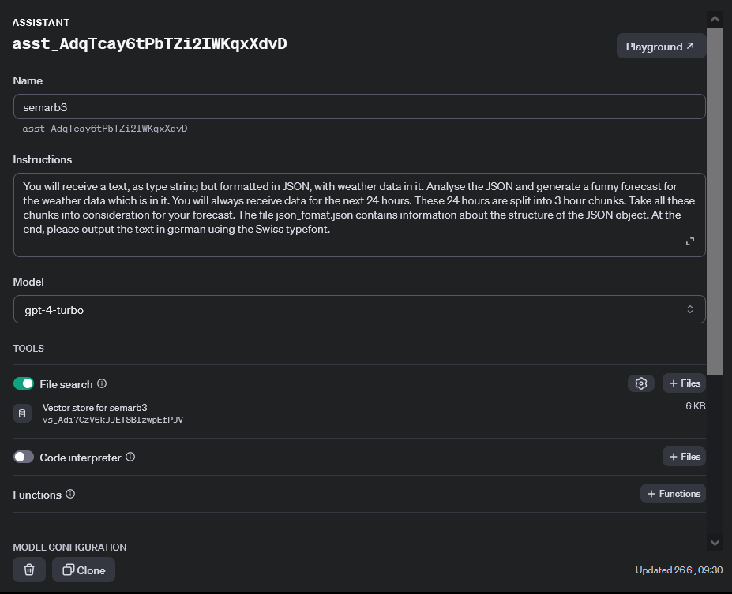

# 3.1.7 OpenAI

Nach der technischen Vorhersage, erhalte ich ein JSON Objekt. Ich kann dieses JSON Objekt direkt und unbearbeitet so an OpenAI weiterleiten.

Ich habe bei OpenAI einen Assistenten erstellt, welcher Zugriff zu einer Beschreibung dieses JSON Objekts hat. Mittels dieser Objekt Beschreibung, kann dieser Assistent anschliessend das zugeführte Objekt verstehen und interpretieren.

[Quelle Bild - Selbsterstellt](../anhang/600-quellen.html#61-bilder)

Man kann diese Beschreibung unter diesem Link anschauen:

<https://github.com/Euthal02/SemArb3_WeatherAPI/blob/main/backend/json_format.json>

Ich bin der Meinung, dass diese Möglichkeit das ganze viel einfacher gemacht hat. Nach meinen ersten Tests mit ChatGPT, wie ich das ganze aufbauen kann, habe ich realisiert, dass diese Technologie viele Möglichkeiten bringt um Daten schnell zu analysieren. Anstatt jedes Mal die JSON Struktur zu durchforsten und alle Infos zusammen zu kratzen, kann ich dies nun einfach ChatGPT überlassen, mit einer einfachen Objekt Beschreibung.

## Voraussetzungen

Um den Assistenten zu nutzen, muss ein OpenAI Account erstellt werden und dieser Account muss mit "Funds" aufgeladen werden. Ich habe am Anfang des Projekts 20 Franken einbezahlt, wovon jetzt noch 17.41.- übrig sind.

[Quelle Bild - Selbsterstellt](../anhang/600-quellen.html#61-bilder)
