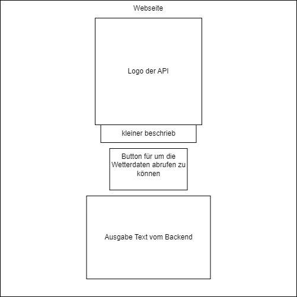

# 3.2.1 Anforderungen

Damit das Frontend entwickelt werden kann, müssen erste die Anforderungen daran definiert sein. Um diese Anforderungen zu definieren habe ich mich mit meinem Gruppenpartner zusammengeschlossen und Brainstorming betrieben. Wir haben auch einene kleinen entwurf gemacht wie das GUI aussehen soll.

{: width="250px" }

[Quelle Bild - Icons](../anhang/600-quellen.html#64-icons)

- Schlichtes UI
- Button der Klickbar ist
- Auslesen des Standords des clients
- API Call an das Backend senden (mit den Daten des Standorts)
- Rückmeldung vom Backend als Json erhalten
- Json als Lesbarer Text anzeigen

Unsere Anforderungen an das Frontend wurden relativ schnell klar, da wir es schlicht und einfach halten wollten. Da eines unserer Ziele war, nur das as Wetter als text anzuzeigen, wollten wir so wenig wie möglich auf der Benutzeroberfläche haben. Wir beschlossen, dass wir ein Logo, einen kurzen Informationstext und einen Button haben wollen, über den man nach dem Klick die Wetterprognose erhält. Damit der Standord ermittelt werden kann, habe ich geplant eine extern API anzusprechen, welche den Standort der IP-Adresse übermittelt. Nun hat sicher herausgestellt, dass dies sehr ungenau ist, wenn man keine IPV6 Adresse hat. Aus diesem Grund habe ich dann weiter recherchiert. Ich habe dann herausgefunden, dass JavaScript bereits eine Funktion mitsichbringt welche sich "getLocation" nennt. Mit dieser Funktion werden die GPS Daten des Geräts lokalisiert. Somit können dem Backend die Längen- und Breitengrade übermittelt werden.

So sieht unsere Skizze aus

{: width="500x" }

[Quelle Bild - Selbsterstellt](../anhang/600-quellen.html#61-bilder)
