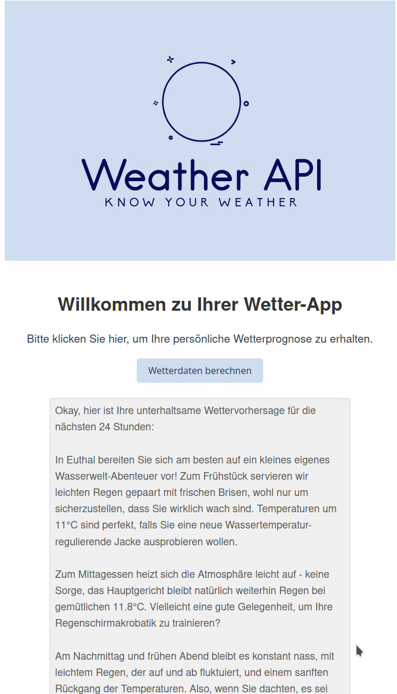

# 3.2.3 Funktionsweise

In diesem Abschnitt wird die Funktionsweise des Frontends beschrieben.

{: width="250px" }

Um die Wetterdaten lesen zu können, braucht es ein Frontend. Was das Frontend alles können muss, wurde bereits bei den Anforderungen geklärt.

Damit die Wetterdaten aufgerufen werden können, muss der *Button* "Wetterdaten berechnen" auf unserer Webseite betätigt werden, welcher dann den Standort des Geräts über GPS-Daten lokalisiert. Damit das möglich ist, muss man die vom Browser aus aufgerufene Erlaubnis für das "Tracking" akzeptieren. Anschliessend werden die Längen- und Breitengrade des Geräts an die API im Backend gesendet, welches Marco programmiert hat. Bevor das aber geschehen kann, muss sich das Frontend am Backend authentifizieren. Dieser Prozess geschieht voll automatisiert und man merkt davon im Frontend nichts.

Das Frontend meldet sich am Backend mit E-Mail und Passwort an. Nach der Anmeldung erhält der Benutzer ein Authentifizierungs-Token. Dieses Token wird benötigt, um die "GET"-Anfrage im Backend durchführen zu können. Nachdem nun der Token generiert und gespeichert wurde und die Längen- und Breitengrade dem Backend zugestellt wurden, wartet das Frontend auf die Ausgabe. Die Ausgaben kommen jeweils als JSON zurück und können daher relativ einfach weiterverwendet werden. Die Ausgabe des Backends wird dann formatiert und für den Benutzer gut leserlich im Frontend angezeigt.

So sieht eine Ausgabe aus:

