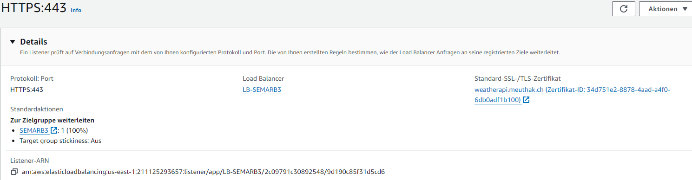

# 3.2.4 Infrastruktur

Die Infrastruktur wurde bereits im Backend beschrieben. Da ich im Frontend die Infrasturktur gleich aufgebaut habe, wird diese hier nicht nochmals genauer beschrieben. Der Aufbau kann hier eingesene werden [Aufbau der Infrastuktur](312-infrastruktur.html).
Es unterscheiden sich nur einzelne Werte wie die Elastic IP, HTTP Anbindung und SSL-Zertifikat.

{: width="250px" }

[Quelle Bild - Icons](../anhang/quellen.html#54-icons)

Die zugewiesene Elastic IP ist:

35.174.246.209

Für die Sicherheitsgruppe der Instanz erlauben ich SSH für das Management den Port 443 für den Loadbalancer und HTTP damit man auf die Webseite kommt.

{: width="1000px" }

## Load Balancer

Da uns die EC2 Instanz eine Öffentliche IP bereitstellt, nutzen wir die Chance des AWS Load Balancers um ein Zertifikat für unseren Service zu erhalten. Der Load Balancer beinhaltet folgende Teile. Jede Abfrage auf den Load Balancer muss durch jedes Teilstück durchgehen.

{: width="1000px" }

Zusätzlich ist auf dem Listener ein Zertifikat bereitgestellt, für die Domain:

<https://weatherapi.meuthak.ch>

{: width="1000px" }

Dazu musste Marco auf seiner Domain folgende Einträge hinzufügen:

``` bash
...
weatherapi                                   3600 IN CNAME lb-semarb3-119182634.us-east-1.elb.amazonaws.com.
_dasisteintest123456789e3260f8f90.backend    3600 IN CNAME _dasisteintest3c1821234567897bee9.sdgjtdhdhz.acm-validations.aws..
...
```
